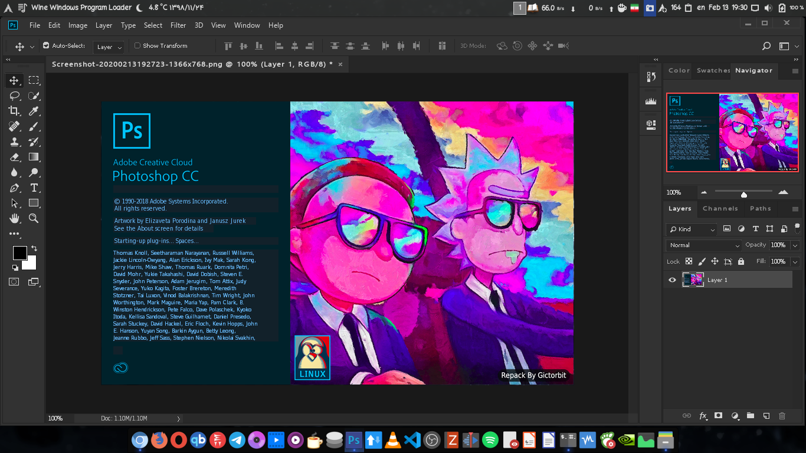

# Photoshop CC v19 installer for Linux
This bash script helps you to install Photoshop CC version 19 on your Linux machine using wine behind the scene
and sets some necessary components up for the best performance

## :rocket: Features
* downloads necessary components and installs them (`vcrun`, `atmlib`, `msxml`...)
* downloads `photoshop.exe` installer
* creates photoshop command and a desktop entry
* wine dark mode
* supports graphic cards like (`intel`, `Nvidia`)
* saves the downloaded files in your cache directory
* It's free and you will not need any license key
* works on any Linux distribution
* 

